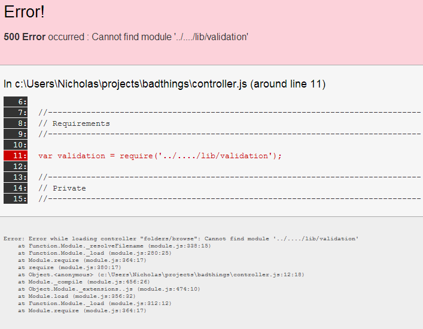

# Debug Error Page for Express

This is a small module that provides an error page with helpful debugging information on it. The most useful part is that it tracks down the probable cause of the error and shows you a snippet of the file with the likely cause highlighted. As such, it should be used in *development only* and turned off for production mode.

The page is heavily inspired by the v1.0 [Play Framework](http://playframework.com). In fact, the error page template is the one that the Play Framework used, with some modifications for Express.

## Version 0.0.0

Basically, it's an alpha. Not tests yet. I'd love your help in making them. :)

## What's it look like?

## Copyright and License

debug-errorpage Copyright 2014 Nicholas C. Zakas. All rights reserved. MIT license.

Play Framework Copyright 2010

    Guillaume Bort (http://guillaume.bort.fr)
    zenexity (http://www.zenexity.fr)
    Play framework contributors (https://github.com/playframework/play/contributors)

[Apache 2 License](http://www.apache.org/licenses/LICENSE-2.0.html)
